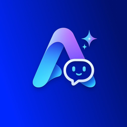
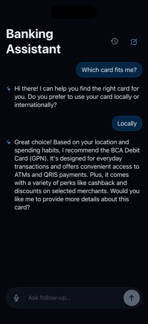
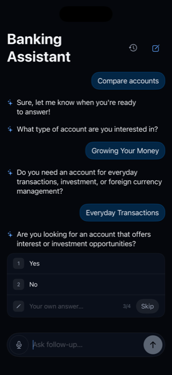

# Arta AI

### On-device banking assistant — understand your options, choose with confidence.

**[🔗 Live Site](https://oleksandrkry.github.io/CH4_AI_Banking_app/)** &nbsp;·&nbsp; **[📸 Screenshots](#-screenshots)** &nbsp;·&nbsp; **[🧠 Tech Stack](#-tech-stack)** &nbsp;·&nbsp; **[👥 Team](#-team)**

---

## What it does

Banks carry hundreds of products with different fees, benefits, and requirements — enough to confuse new and experienced customers alike. Arta AI answers natural-language questions, asks only the follow-up questions it actually needs, and recommends the right product from the bank's real catalog, entirely on-device.

## 📸 Screenshots

  
  &nbsp;&nbsp;
  

## 🧠 Tech Stack

| Framework | Role |
|---|---|
| **SpeechAnalyzer** | Converts spoken questions into text |
| **Foundation Models** | Interprets requests, generates responses |
| **SwiftData** | Stores products, documentation, conversation history |
| **NLContextualEmbeddings** | Semantic retrieval over the product catalog |

**Architecture:** RAG with hybrid retrieval (vector + relational) · 100% Swift · fully on-edge, no server.

## 👥 Team

| Name | Role |
|---|---|
| Alex | Project Manager, Software Engineer |
| Artem | Teamlead & Data Scientist |
| Bagus | Backend & AI Engineer |
| Raffi | Frontend Engineer |
| Gian | Fullstack Engineer |

---

<strong>📋 Technical Exploration Report</strong> — the team's process log: starting assumptions, what we tried, what surprised us, and how our decisions evolved (click to expand)

# 1. Present Your Team

*(See [Team](#-team) above.)*

## Project Overview

Our project is an on-device AI banking assistant built using Apple Intelligence technologies. Users can interact with the assistant through voice or text to ask banking-related questions. The application retrieves relevant banking products and documentation using semantic search and generates responses using Apple's Foundation Models. All data, including conversations, is stored locally to prioritize privacy.

---

# 2. Starting Assumption

> **Note:** This section reflects our initial assumptions before any experimentation and will not be modified later.

## We think we'll end up using

- SpeechAnalyzer for speech-to-text transcription
- Foundation Models for natural language understanding and response generation
- SwiftData for storing products, documentation, and conversation history
- NLContextualEmbeddings for semantic search and retrieval

## Because

These frameworks are part of Apple's AI ecosystem and appear to integrate well together for building an on-device AI assistant. We believe semantic retrieval combined with a Foundation Model will produce more relevant answers than simple keyword matching while keeping user data private.

---

# 3. The Exploration Log

## What we browsed, and what surprised us

### Documentation

- Apple SpeechAnalyzer
- Apple Foundation Models
- SwiftData
- NLContextualEmbeddings
- Retrieval-Augmented Generation (RAG) concepts

### Unexpected findings

- The speech recognizer framework perform better than speech analyzer in catching the best voice for a short term voice input

---

## What we actually built or tested

### Completed

- Created GitHub repository
- Configured Git with SSH authentication
- Created Jira project
- Created Kanban board
- Defined project architecture
- Assigned team responsibilities
- Created project documentation
- Prototype SpeechAnalyzer
- Create SwiftData models
- Generate contextual embeddings
- Build retrieval pipeline
- Integrate Foundation Models
- Test AI responses

---

# 5. Real Limitations Hit

> This section will be updated as development progresses.

Potential topics include:

- Foundation Model limitations
- Embedding quality
- Speech recognition accuracy
- Simulator vs physical device limitations
- Apple Intelligence availability
- Performance issues

---

# 6. The Revised Decision

## Final decision

- The name of our app is Arta AI
- We used SpeechRecognizer instead of SpeechAnalyzer

## What changed since Section 1, and why
- SpeechAnalyzer -> SpeechRecognizer, because it worked better than speech analyzer framework

---

# App Track Addendum

## About the Frameworks

*(See [Tech Stack](#-tech-stack) above.)*

During development, we will evaluate whether using semantic retrieval provides a measurable improvement over traditional keyword search.

---

## About Accessibility and Localization

- Speech-to-Text

---

## About Privacy

Our application is designed with privacy as a priority.

### Data stored locally

- Banking products
- Banking documentation
- Conversation history

### Permissions

**Microphone**

Used only for voice input. If microphone permission is denied, users can continue using the application by typing their questions.

No personal banking credentials, financial account information, or sensitive user data will be collected or transmitted.

---

## Project Status

### Current Progress

- ✅ Repository created
- ✅ GitHub configured
- ✅ Jira Kanban board created
- ✅ Initial project planning completed
- ✅ AI prototype in progress
- ✅ SwiftData implementation pending
- ✅ Retrieval pipeline pending
- ✅ Foundation Models integration pending

